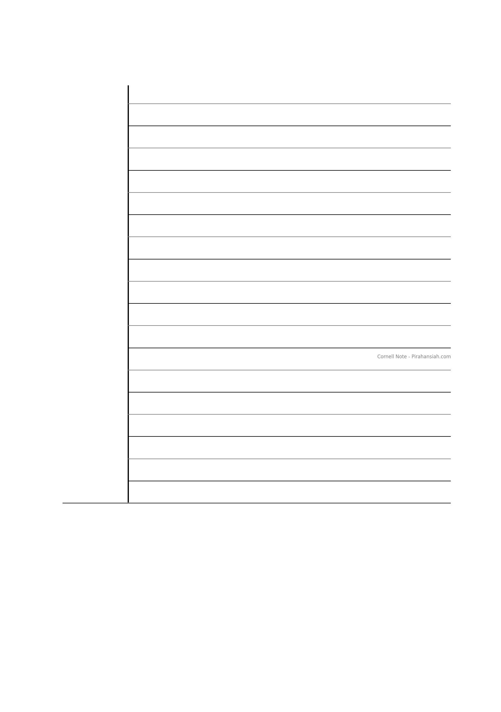
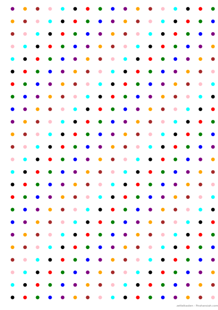
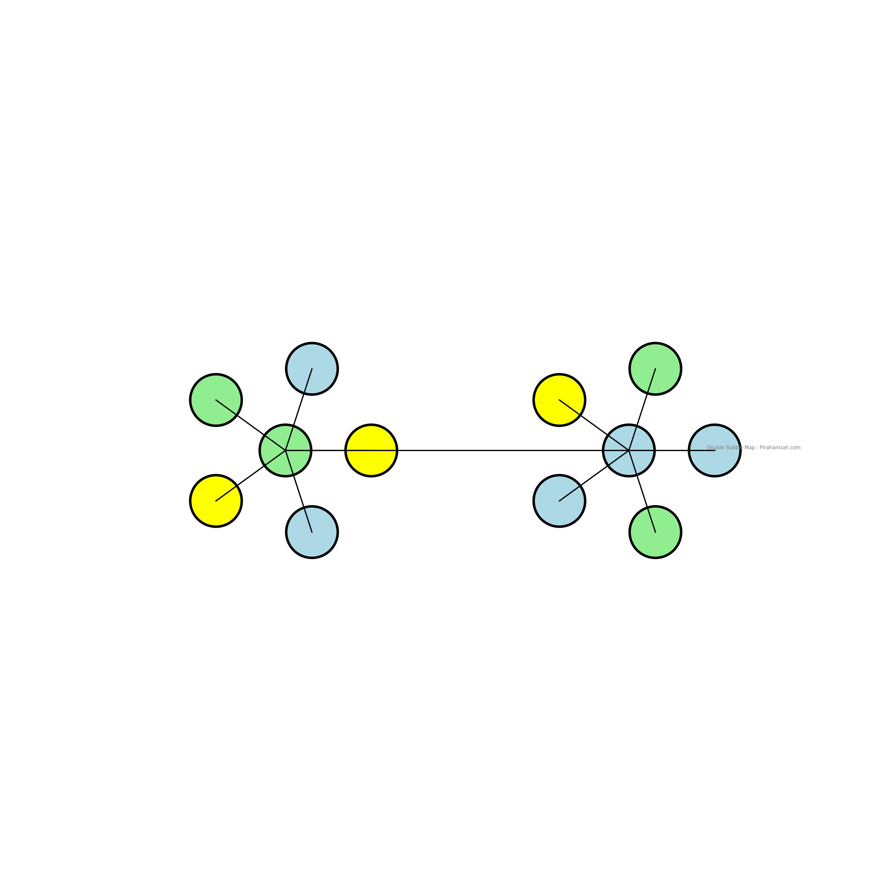
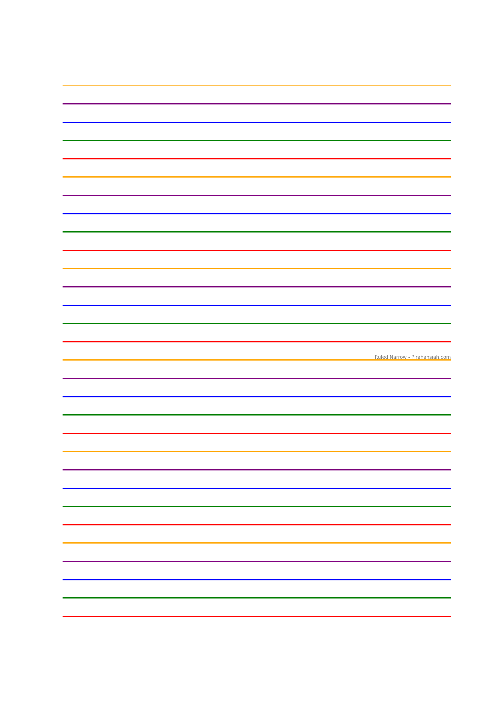
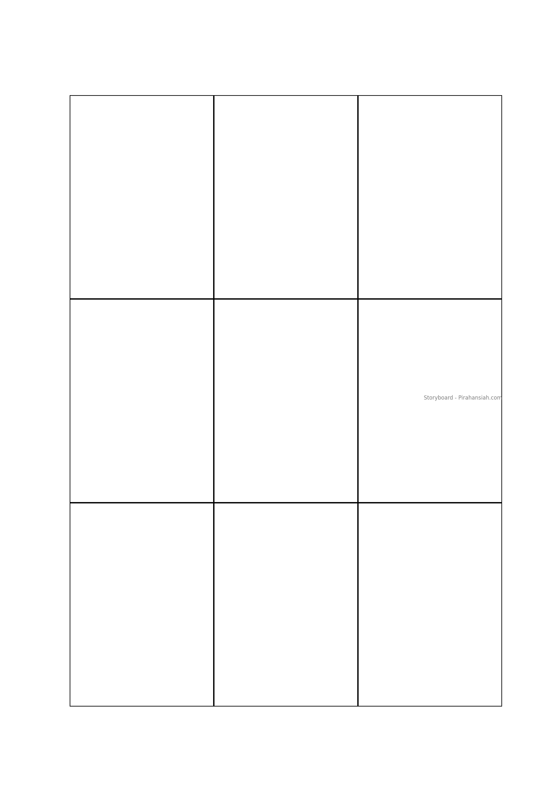
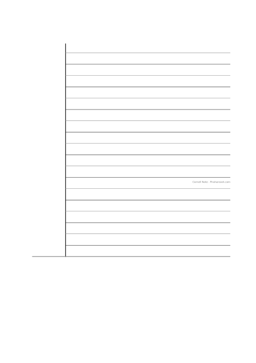
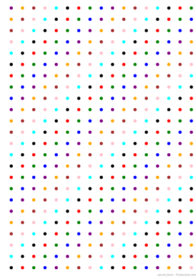
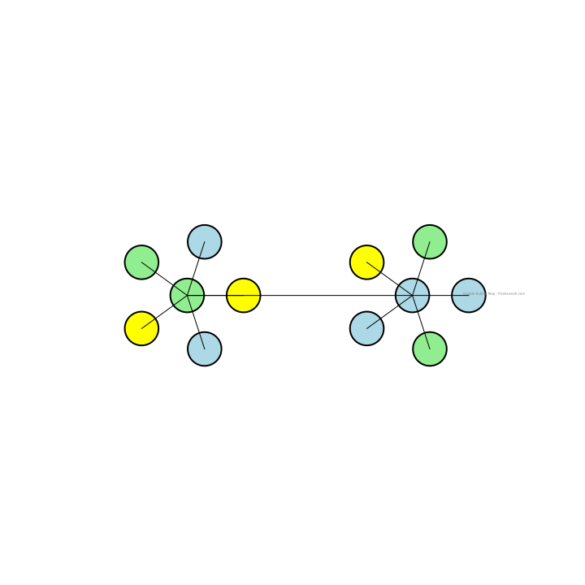
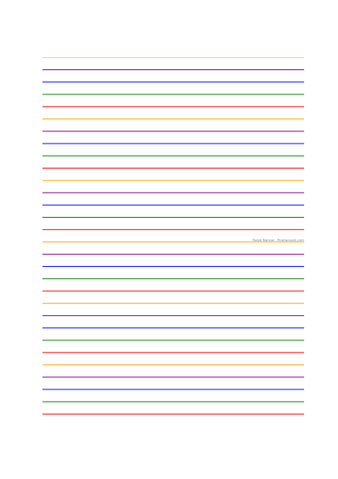

Navigation 
[[2_Topic_MOC]]
[[4_SubTopic_MOC]]
[[6_Primary_Source_MOC]]

# Note-Taking Methods

## Outline Note-Taking Method
- Organize notes in a structured, hierarchical format.
- Use headings and subheadings to group related information.
- Indent subpoints under main points for clarity.

-# Main Topic
-## Subtopic 1
   - Point 1
   - Point 2
    - Subpoint 1
    - Subpoint 2
-## Subtopic 2
   - Point 1
   - Point 2
    - Subpoint 1
    - Subpoint 2

## Cornell Note-Taking Method
- Divide the page into three sections: Notes, Cues, and Summary.
- Notes: Record detailed notes during the lecture or reading.
- Cues: Write keywords or questions in the left-hand margin.
- Summary: Summarize the main points at the bottom of the page.

## Boxing Note-Taking Method
- Divide the page into boxes, each dedicated to a specific topic.
- Helps in visually separating and organizing different pieces of information.
- Useful for visual learners who prefer spatial organization.

Topic
| Box 1 | Box 2 |
|-------|-------|
| Note  | Note  |
| Note  | Note  |

---

## Charting Note-Taking Method
- Create a chart or table to organize information.
- Use columns and rows to compare and contrast data or ideas.
- Effective for subjects that involve categories, such as history or sociology.

Topic
| Column 1 | Column 2 | Column 3 |
|----------|----------|----------|
| Data 1   | Data 2   | Data 3   |
| Data 4   | Data 5   | Data 6   |
---

## Mapping Note-Taking Method
- Visualize notes as a map or web of interconnected ideas.
- Start with a central idea and branch out with related topics.
- Use lines and arrows to show connections between concepts.

Central Idea
- Branch 1
  - Sub-branch 1
  - Sub-branch 2
- Branch 2
  - Sub-branch 1
  - Sub-branch 2

---

## Sentence Note-Taking Method
- Write each piece of information as a separate sentence.
- Number each sentence for reference and organization.
- Simple and straightforward for capturing linear information.

1. Sentence 1
2. Sentence 2
3. Sentence 3
4. Sentence 4

---

## Visualizations

### Journal Dot Pattern
- Use dot grids to create customizable layouts for notes.
- Ideal for bullet journaling, where flexibility in structure is needed.
- Helps in drawing diagrams, charts, and organizing information creatively.
. . . . . . . . . .
. . . . . . . . . .
. . . . . . . . . .
. . . . . . . . . .

### Double Bubble Map
- A visual tool for comparing and contrasting two ideas or topics.
- Draw two bubbles representing the main ideas, with overlapping areas for similarities.
- Use surrounding bubbles to detail differences.

(Main Idea 1) <---> (Main Idea 2)
      |                     |
  (Difference 1)       (Difference 2)
      |                     |
(Similarity 1) <--> (Similarity 2)

---

### Ruled Narrow
- A lined pattern with narrow spacing between lines.
- Useful for writing detailed notes in a confined space.
- Helps maintain neat and legible handwriting.

### Storyboard
- A sequential layout for planning and visualizing narratives.
- Divide the page into frames or panels to represent different scenes or steps.
- Useful for visualizing processes, stories, or presentations.

| Frame 1 | Frame 2 | Frame 3 |
|---------|---------|---------|
| Scene 1 | Scene 2 | Scene 3 |
| Step 1  | Step 2  | Step 3  |

---

Venn diagram 
conceptMap
flowcharts
mindmap

The list of image templates for all these visual notes is in the folder 

The list of image templates for all these visual notes is in the folder:

### PNG Images

### SVG Images

