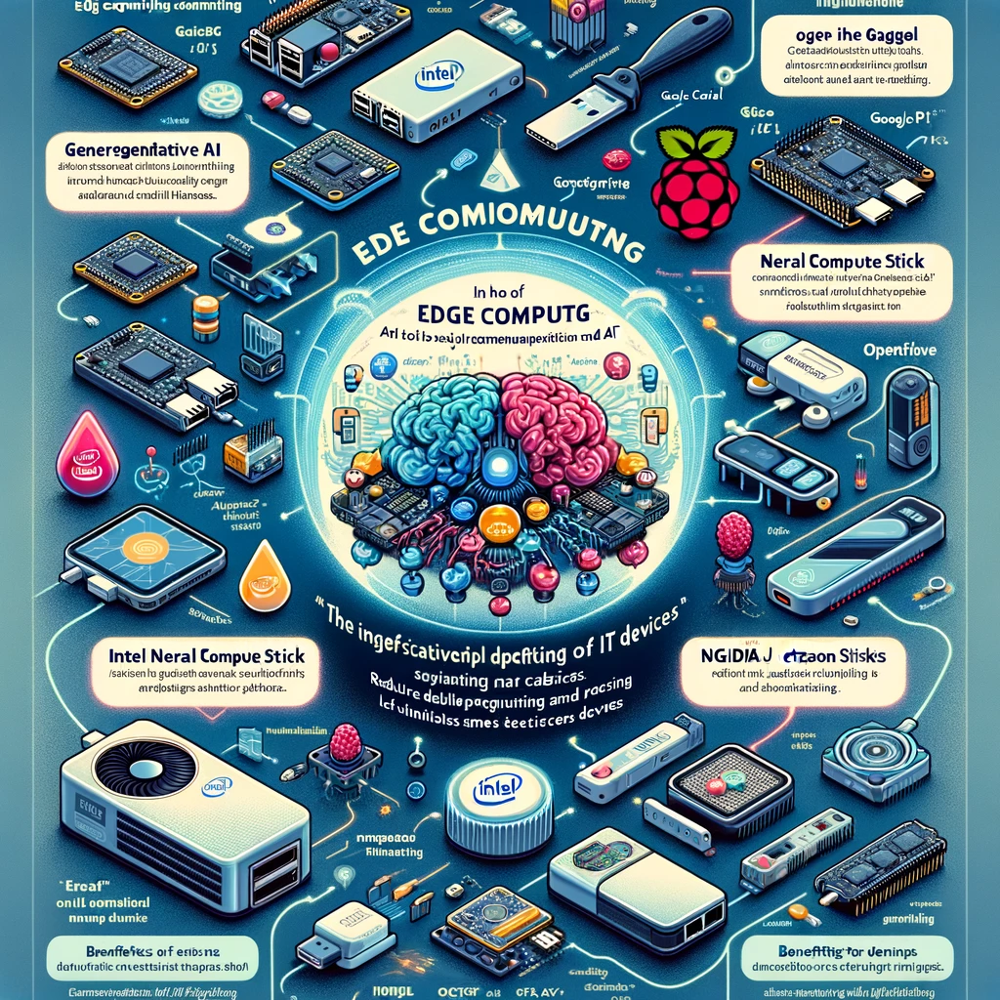

<h1>Action Plans</h1>

# Edge + LLMs

## Generative AI and Edge Computing Overview

Generative AI, including large language models (LLMs) like ChatGPT, is becoming increasingly integrated into edge computing devices such as IoT gadgets, Raspberry Pis, Intel Neural Compute Sticks, and Nvidia Jetson modules. This shift aims to make advanced AI technologies more accessible for real-world applications, notably in computer vision and generative AI tasks.

### Edge Hardware Capabilities

Raspberry Pi 3/4 (with accelerator support)
Raspberry Pi 5
Google Coral (TPU)
Intel® Neural Compute Stick 2
NVIDIA Jetson Series (Nano, AGX Xavier, AGX Orin)
OpenCV AI Kits (OAK, OAK-D, OAK-D with WiFi, OAK-D-PoE, OAK-D lite)

### Tools and Libraries

Intel® Distribution of OpenVINO™ Toolkit enhances AI performance on edge devices.
TensorFlow Lite offers a lightweight, low-latency solution for edge AI with privacy and power efficiency.
OpenVINO™ Toolkit facilitates the use of pre-trained models and optimization for Intel devices.
Edge AI Introduction

Edge computing processes data locally to reduce latency, enhance security, and ensure reliability when cloud connectivity is limited. It supports real-time decision-making for IoT devices and smart applications. Despite the growth of cloud computing, edge computing addresses critical needs for immediate data processing and privacy, crucial for applications like autonomous vehicles and private data handling. The evolution from networked ATMs and the internet to smart devices underscores the rapid expansion of IoT, highlighting the importance of edge computing in modern technology landscapes.

### Key Advantages of Edge AI

Reduced data transmission costs and improved efficiency in remote or disaster-prone areas.
Immediate processing capabilities for critical applications such as autonomous driving.
Enhanced privacy for sensitive data by processing it locally.
Simplified and efficient software deployment tailored to specific edge devices.
This concise overview captures the essence of integrating generative AI into edge computing, emphasizing the hardware, tools, and strategic benefits. The shift towards edge AI not only makes cutting-edge technology accessible for various applications but also ensures efficiency, privacy, and real-time processing, marking a significant step forward in the IoT and smart device ecosystem.