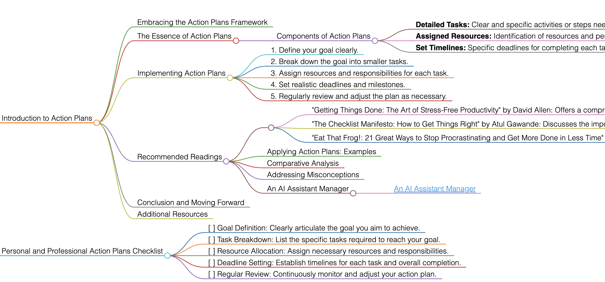

<h1>Action Plans</h1>

# Introduction to Action Plans

## Embracing the Action Plans Framework
Action Plans are detailed, step-by-step guidelines set to achieve specific goals. They outline the necessary tasks, resources, and timelines for accomplishing objectives, providing a clear roadmap for success.

## The Essence of Action Plans
Action Plans are essential for breaking down goals into manageable tasks. They help in organizing efforts, ensuring accountability, and monitoring progress.

### Components of Action Plans
- **Detailed Tasks:** Clear and specific activities or steps needed to reach the goal.
- **Assigned Resources:** Identification of resources and personnel required for each task.
- **Set Timelines:** Specific deadlines for completing each task and overall project.

## Implementing Action Plans
To create an effective action plan, follow these guidelines:
1. Define your goal clearly.
2. Break down the goal into smaller tasks.
3. Assign resources and responsibilities for each task.
4. Set realistic deadlines and milestones.
5. Regularly review and adjust the plan as necessary.

## Recommended Readings
- "Getting Things Done: The Art of Stress-Free Productivity" by David Allen: Offers a comprehensive method for improving productivity and managing tasks effectively.
    - **Key Takeaways:** Techniques for organizing tasks; strategies for stress-free productivity.
- "The Checklist Manifesto: How to Get Things Right" by Atul Gawande: Discusses the importance of checklists in managing complex tasks.
    - **Key Takeaways:** The power of simplicity in planning; using checklists to avoid errors.
- "Eat That Frog!: 21 Great Ways to Stop Procrastinating and Get More Done in Less Time" by Brian Tracy: Provides practical methods for overcoming procrastination and improving efficiency.
    - **Key Takeaways:** Strategies for prioritizing tasks; techniques for tackling challenging tasks.

### Applying Action Plans: Examples
Use Action Plans for various goals such as project completion, personal development, or organizational restructuring.

### Comparative Analysis
Action Plans stand out for their detailed and structured approach to achieving goals.

### Addressing Misconceptions
Action Plans are not just for business or project management; they can be effectively applied in personal goal setting.

### An AI Assistant Manager
- [An AI Assistant Manager](https://pirahansiah.com/site/pages/ChatGPT)

## Conclusion and Moving Forward
By adopting the Action Plans approach, you can systematically pursue and achieve your goals. This guide has offered insights into effectively using Action Plans in various aspects of life and work.

## Additional Resources
For further exploration of effective planning and task management, delve into the recommended literature.

# Personal and Professional Action Plans Checklist
- [ ] Goal Definition: Clearly articulate the goal you aim to achieve.
- [ ] Task Breakdown: List the specific tasks required to reach your goal.
- [ ] Resource Allocation: Assign necessary resources and responsibilities.
- [ ] Deadline Setting: Establish timelines for each task and overall completion.
- [ ] Regular Review: Continuously monitor and adjust your action plan.

<h1></h1>