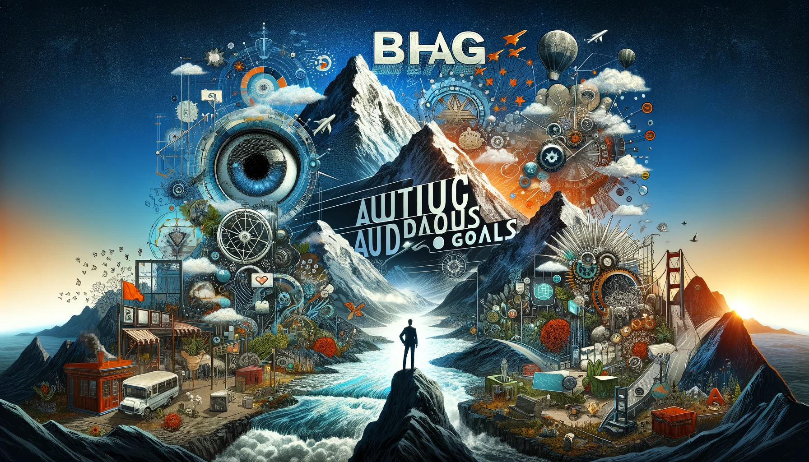
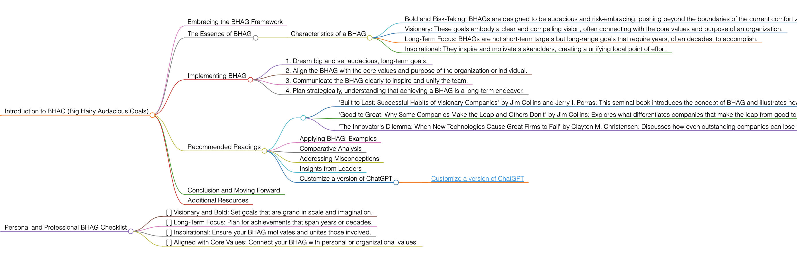

<h1>BHAG</h1>

# Introduction to BHAG (Big Hairy Audacious Goals)

## Embracing the BHAG Framework
BHAG (Big Hairy Audacious Goals) represents a concept in strategic business planning, encouraging organizations to define visionary goals that are more strategic and emotionally compelling. These goals are typically long-term, requiring a decade or more to achieve.

## The Essence of BHAG
A BHAG is a powerful way to stimulate progress and capture the imagination. It is ambitious, potentially transformative, and encompasses a long-term vision that drives change and innovation.

### Characteristics of a BHAG
- **Bold and Risk-Taking:** BHAGs are designed to be audacious and risk-embracing, pushing beyond the boundaries of the current comfort zone.
- **Visionary:** These goals embody a clear and compelling vision, often connecting with the core values and purpose of an organization.
- **Long-Term Focus:** BHAGs are not short-term targets but long-range goals that require years, often decades, to accomplish.
- **Inspirational:** They inspire and motivate stakeholders, creating a unifying focal point of effort.

## Implementing BHAG
To apply BHAG effectively, follow these guidelines:
1. Dream big and set audacious, long-term goals.
2. Align the BHAG with the core values and purpose of the organization or individual.
3. Communicate the BHAG clearly to inspire and unify the team.
4. Plan strategically, understanding that achieving a BHAG is a long-term endeavor.

## Recommended Readings
- "Built to Last: Successful Habits of Visionary Companies" by Jim Collins and Jerry I. Porras: This seminal book introduces the concept of BHAG and illustrates how visionary companies use bold missions to stimulate progress.
    - **Key Takeaways:** Insight into how enduringly great companies achieve lasting success; introduction of the BHAG concept.
- "Good to Great: Why Some Companies Make the Leap and Others Don't" by Jim Collins: Explores what differentiates companies that make the leap from good to great, including the role of BHAGs in driving transformation.
    - **Key Takeaways:** Understanding the principles that propel companies from mediocrity to excellence; insights into the role of leadership and vision.
- "The Innovator's Dilemma: When New Technologies Cause Great Firms to Fail" by Clayton M. Christensen: Discusses how even outstanding companies can lose their market leadership due to technological innovation and the importance of visionary goals in staying ahead.
    - **Key Takeaways:** Understanding the challenges of disruptive technologies; strategies for maintaining market leadership through innovation and ambitious goal-setting.

### Applying BHAG: Examples
Use BHAG in various scenarios, such as setting revolutionary business goals or defining long-term personal visions.

### Comparative Analysis
BHAGs stand out for their ambitious nature and long-term vision, making them ideal for organizations and individuals seeking transformative change and innovation.

### Addressing Misconceptions
BHAGs are not just for business settings; they can be effectively applied in any context where visionary, long-term goals are desired.

### Insights from Leaders
Quotes from industry leaders can underscore the importance of visionary thinking and audacious goal setting.

### Customize a version of ChatGPT 
- [Customize a version of ChatGPT ](https://chat.openai.com/g/g-3JEKe3tVr-goal-setting-guru)

## Conclusion and Moving Forward
By integrating the BHAG approach, you can set goals that are visionary, transformative, and long-term. This guide has offered insights into effectively using the BHAG methodology in various aspects of life and work.

## Additional Resources
For a deeper understanding of visionary planning and audacious goal setting, explore related literature and case studies.

# Personal and Professional BHAG Checklist
- [ ] Visionary and Bold: Set goals that are grand in scale and imagination.
- [ ] Long-Term Focus: Plan for achievements that span years or decades.
- [ ] Inspirational: Ensure your BHAG motivates and unites those involved.
- [ ] Aligned with Core Values: Connect your BHAG with personal or organizational values.

<h1></h1>
