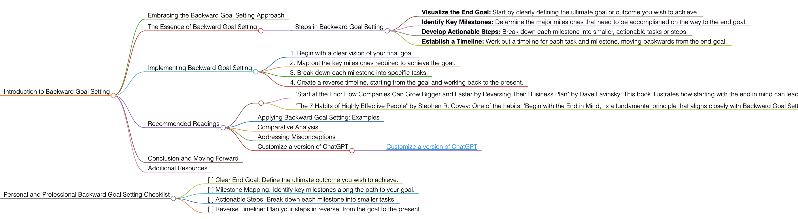

<h1>Backward Goal Setting</h1>

# Introduction to Backward Goal Setting

## Embracing the Backward Goal Setting Approach
Backward Goal Setting is a strategic approach to planning and achieving objectives. It involves starting with the end goal in mind and then working backwards to determine the necessary steps to achieve it. This method is particularly effective for complex or long-term goals.

## The Essence of Backward Goal Setting
Backward Goal Setting focuses on visualizing the final outcome first and then identifying the milestones and tasks needed to reach that outcome. This reverse engineering of goals helps in creating a clear and structured plan for success.

### Steps in Backward Goal Setting
- **Visualize the End Goal:** Start by clearly defining the ultimate goal or outcome you wish to achieve.
- **Identify Key Milestones:** Determine the major milestones that need to be accomplished on the way to the end goal.
- **Develop Actionable Steps:** Break down each milestone into smaller, actionable tasks or steps.
- **Establish a Timeline:** Work out a timeline for each task and milestone, moving backwards from the end goal.

## Implementing Backward Goal Setting
To apply Backward Goal Setting effectively, follow these guidelines:
1. Begin with a clear vision of your final goal.
2. Map out the key milestones required to achieve the goal.
3. Break down each milestone into specific tasks.
4. Create a reverse timeline, starting from the goal and working back to the present.

## Recommended Readings
- "Start at the End: How Companies Can Grow Bigger and Faster by Reversing Their Business Plan" by Dave Lavinsky: This book illustrates how starting with the end in mind can lead to more effective business planning and growth.
    - **Key Takeaways:** Strategies for growth by focusing on the end goal; practical advice for reverse engineering success.
- "The 7 Habits of Highly Effective People" by Stephen R. Covey: One of the habits, 'Begin with the End in Mind,' is a fundamental principle that aligns closely with Backward Goal Setting.
    - **Key Takeaways:** Insights into effective personal and professional habits; the importance of vision and planning in achieving goals.

### Applying Backward Goal Setting: Examples
Use Backward Goal Setting in various scenarios, such as personal development planning, project management, or business strategy development.

### Comparative Analysis
Backward Goal Setting stands out for its focus on strategic foresight and detailed planning, making it ideal for achieving complex and long-term goals.

### Addressing Misconceptions
Backward Goal Setting is not just for business or project planning; it can be effectively applied to any goal that benefits from structured planning and foresight.

### Customize a version of ChatGPT 
- [Customize a version of ChatGPT](https://chat.openai.com/g/g-3JEKe3tVr-goal-setting-guru)

## Conclusion and Moving Forward
By integrating the Backward Goal Setting approach, you can set goals with a clear path to achievement. This guide has offered insights into effectively using this methodology in various aspects of life and work.

## Additional Resources
For a deeper understanding of strategic planning and effective goal-setting techniques, explore related literature and case studies.

# Personal and Professional Backward Goal Setting Checklist
- [ ] Clear End Goal: Define the ultimate outcome you wish to achieve.
- [ ] Milestone Mapping: Identify key milestones along the path to your goal.
- [ ] Actionable Steps: Break down each milestone into smaller tasks.
- [ ] Reverse Timeline: Plan your steps in reverse, from the goal to the present.

<h1></h1>
