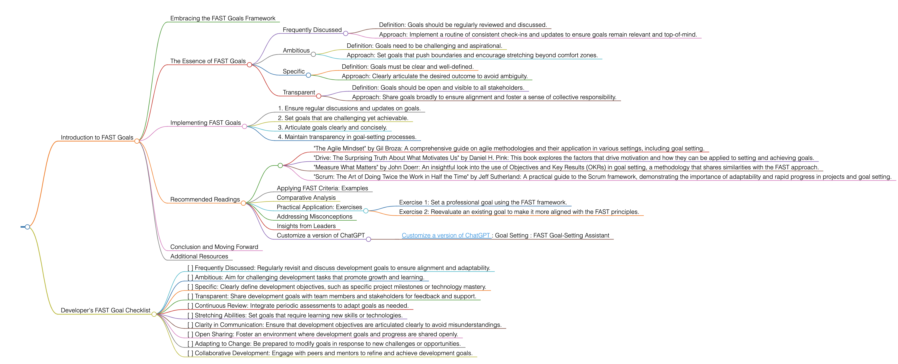

<h1>FAST</h1>

# Introduction to FAST Goals

## Embracing the FAST Goals Framework
FAST goals represent a dynamic approach to goal setting, emphasizing aspects that foster rapid progress and adaptability. This methodology is designed to complement traditional goal-setting frameworks like SMART, focusing more on agility and continuous improvement.
## The Essence of FAST Goals
FAST, an acronym for Frequently Discussed, Ambitious, Specific, and Transparent, is a modern approach that encourages regular review, high aspirations, clear objectives, and openness. This framework is particularly effective in fast-paced environments where flexibility and ongoing feedback are crucial.
### Frequently Discussed
- Definition: Goals should be regularly reviewed and discussed.
- Approach: Implement a routine of consistent check-ins and updates to ensure goals remain relevant and top-of-mind.
### Ambitious
- Definition: Goals need to be challenging and aspirational.
- Approach: Set goals that push boundaries and encourage stretching beyond comfort zones.
### Specific
- Definition: Goals must be clear and well-defined.
- Approach: Clearly articulate the desired outcome to avoid ambiguity.
### Transparent
- Definition: Goals should be open and visible to all stakeholders.
- Approach: Share goals broadly to ensure alignment and foster a sense of collective responsibility.
## Implementing FAST Goals
To apply FAST goals effectively, follow these guidelines:
1. Ensure regular discussions and updates on goals.
2. Set goals that are challenging yet achievable.
3. Articulate goals clearly and concisely.
4. Maintain transparency in goal-setting processes.
## Recommended Readings
- "The Agile Mindset" by Gil Broza: A comprehensive guide on agile methodologies and their application in various settings, including goal setting.
- "Drive: The Surprising Truth About What Motivates Us" by Daniel H. Pink: This book explores the factors that drive motivation and how they can be applied to setting and achieving goals.
- "Measure What Matters" by John Doerr: An insightful look into the use of Objectives and Key Results (OKRs) in goal setting, a methodology that shares similarities with the FAST approach.
- "Scrum: The Art of Doing Twice the Work in Half the Time" by Jeff Sutherland: A practical guide to the Scrum framework, demonstrating the importance of adaptability and rapid progress in projects and goal setting.
### Applying FAST Criteria: Examples
Use FAST criteria in various scenarios, such as setting ambitious sales targets or developing new skills in a rapidly changing industry.
### Comparative Analysis
FAST goals stand apart for their emphasis on continuous discussion and transparency, making them ideal for environments that value agility and adaptability.
### Practical Application: Exercises
- Exercise 1: Set a professional goal using the FAST framework.
- Exercise 2: Reevaluate an existing goal to make it more aligned with the FAST principles.
### Addressing Misconceptions
FAST goals are not just for business settings; they can be effectively applied in personal development and other areas.
### Insights from Leaders
Quotes from industry leaders can highlight the importance of adaptability and continuous improvement in goal setting.
### Customize a version of ChatGPT 
Utilize online resources and tools designed to help structure and track FAST goals effectively.
- [Customize a version of ChatGPT ](https://chat.openai.com/g/g-3JEKe3tVr-goal-setting-guru): Goal Setting : FAST Goal-Setting Assistant
## Conclusion and Moving Forward
By integrating the FAST approach, you can set goals that are adaptable, challenging, and aligned with rapid changes and improvements. This guide has offered insights into effectively using the FAST methodology in various aspects of life and work.
## Additional Resources
For a deeper understanding of agile methodologies and adaptable goal setting, explore related literature and case studies.
# Developer's FAST Goal Checklist
- [ ] Frequently Discussed: Regularly revisit and discuss development goals to ensure alignment and adaptability.
- [ ] Ambitious: Aim for challenging development tasks that promote growth and learning.
- [ ] Specific: Clearly define development objectives, such as specific project milestones or technology mastery.
- [ ] Transparent: Share development goals with team members and stakeholders for feedback and support.
- [ ] Continuous Review: Integrate periodic assessments to adapt goals as needed.
- [ ] Stretching Abilities: Set goals that require learning new skills or technologies.
- [ ] Clarity in Communication: Ensure that development objectives are articulated clearly to avoid misunderstandings.
- [ ] Open Sharing: Foster an environment where development goals and progress are shared openly.
- [ ] Adapting to Change: Be prepared to modify goals in response to new challenges or opportunities.
- [ ] Collaborative Development: Engage with peers and mentors to refine and achieve development goals.

<h1></h1>