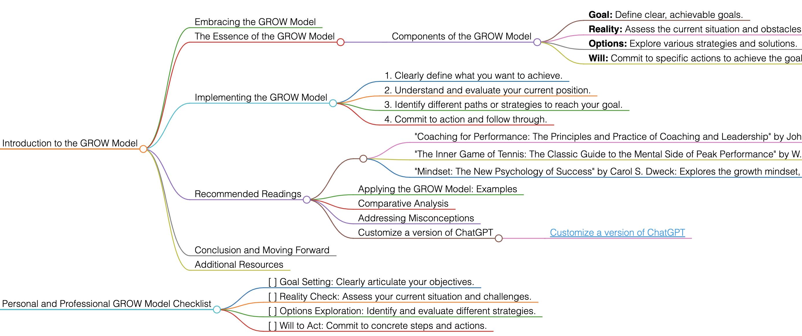

<h1>GROW Model</h1>

# Introduction to the GROW Model

## Embracing the GROW Model
The GROW Model is a popular and effective framework for setting goals and solving problems in coaching, management, and personal development. It stands for Goal, Reality, Options, and Will.

## The Essence of the GROW Model
This model provides a structured approach to goal setting and problem-solving, guiding individuals through a process of exploring Goals, assessing current Reality, considering Options, and determining the Will to act.

### Components of the GROW Model
- **Goal:** Define clear, achievable goals.
- **Reality:** Assess the current situation and obstacles.
- **Options:** Explore various strategies and solutions.
- **Will:** Commit to specific actions to achieve the goal.

## Implementing the GROW Model
To apply the GROW Model effectively, follow these guidelines:
1. Clearly define what you want to achieve.
2. Understand and evaluate your current position.
3. Identify different paths or strategies to reach your goal.
4. Commit to action and follow through.

## Recommended Readings
- "Coaching for Performance: The Principles and Practice of Coaching and Leadership" by John Whitmore: A foundational book on coaching, introducing the GROW Model.
    - **Key Takeaways:** Fundamentals of coaching; practical application of the GROW Model.
- "The Inner Game of Tennis: The Classic Guide to the Mental Side of Peak Performance" by W. Timothy Gallwey: Though focused on tennis, this book's principles apply broadly, including aspects relevant to the GROW Model.
    - **Key Takeaways:** Importance of mindset in achieving performance; techniques for mental and physical improvement.
- "Mindset: The New Psychology of Success" by Carol S. Dweck: Explores the growth mindset, which aligns well with the principles of the GROW Model.
    - **Key Takeaways:** Understanding fixed vs. growth mindsets; impact of mindset on personal development and success.

### Applying the GROW Model: Examples
Use the GROW Model in various scenarios like personal development, career coaching, or business strategy planning.

### Comparative Analysis
The GROW Model stands out for its structured yet flexible approach to problem-solving and goal achievement.

### Addressing Misconceptions
The GROW Model is applicable beyond coaching; it can be a powerful tool in any context that requires goal setting and decision-making.

### Customize a version of ChatGPT 
- [Customize a version of ChatGPT](https://chat.openai.com/g/g-3JEKe3tVr-goal-setting-guru)

## Conclusion and Moving Forward
By adopting the GROW Model, you can approach goals and challenges in a structured and effective manner. This guide has offered insights into effectively using the GROW Model in various aspects of life and work.

## Additional Resources
For further exploration of effective coaching and personal development, delve into the recommended literature.

# Personal and Professional GROW Model Checklist
- [ ] Goal Setting: Clearly articulate your objectives.
- [ ] Reality Check: Assess your current situation and challenges.
- [ ] Options Exploration: Identify and evaluate different strategies.
- [ ] Will to Act: Commit to concrete steps and actions.

<h1></h1>
