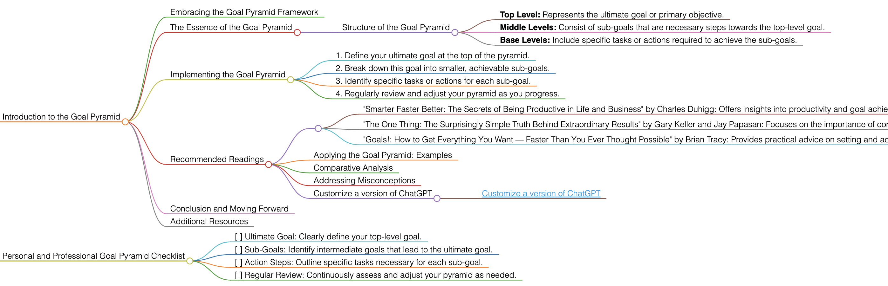

<h1>Goal Pyramid</h1>

# Introduction to the Goal Pyramid

## Embracing the Goal Pyramid Framework
The Goal Pyramid is a strategic tool used for breaking down broad, long-term goals into smaller, more manageable sub-goals and tasks. It visualizes goal setting as a hierarchical structure, helping to simplify and organize the process.

## The Essence of the Goal Pyramid
The Goal Pyramid helps in mapping out a clear path to achieving your ultimate goal. By dividing the goal into smaller steps, it becomes easier to focus on immediate actions that contribute to long-term success.

### Structure of the Goal Pyramid
- **Top Level:** Represents the ultimate goal or primary objective.
- **Middle Levels:** Consist of sub-goals that are necessary steps towards the top-level goal.
- **Base Levels:** Include specific tasks or actions required to achieve the sub-goals.

## Implementing the Goal Pyramid
To apply the Goal Pyramid effectively, follow these guidelines:
1. Define your ultimate goal at the top of the pyramid.
2. Break down this goal into smaller, achievable sub-goals.
3. Identify specific tasks or actions for each sub-goal.
4. Regularly review and adjust your pyramid as you progress.

## Recommended Readings
- "Smarter Faster Better: The Secrets of Being Productive in Life and Business" by Charles Duhigg: Offers insights into productivity and goal achievement, applicable to the Goal Pyramid approach.
    - **Key Takeaways:** Techniques for enhancing productivity; understanding the psychology of goal setting.
- "The One Thing: The Surprisingly Simple Truth Behind Extraordinary Results" by Gary Keller and Jay Papasan: Focuses on the importance of concentrating on one thing at a time, aligning with the Goal Pyramid's step-by-step approach.
    - **Key Takeaways:** Strategies for achieving more by focusing less; the power of prioritization.
- "Goals!: How to Get Everything You Want — Faster Than You Ever Thought Possible" by Brian Tracy: Provides practical advice on setting and achieving goals, relevant to the Goal Pyramid framework.
    - **Key Takeaways:** Proven methods for goal setting and achievement; techniques for breaking down goals into actionable steps.

### Applying the Goal Pyramid: Examples
Use the Goal Pyramid in various scenarios, such as personal development, project management, or business strategy development.

### Comparative Analysis
The Goal Pyramid stands out for its structured approach to breaking down goals into actionable steps.

### Addressing Misconceptions
The Goal Pyramid is not just for business or project planning; it can be effectively applied to any goal that benefits from structured planning.

### Customize a version of ChatGPT 
- [Customize a version of ChatGPT](https://chat.openai.com/g/g-3JEKe3tVr-goal-setting-guru)

## Conclusion and Moving Forward
By adopting the Goal Pyramid approach, you can simplify and organize the path to achieving your goals. This guide has offered insights into using this methodology effectively in various aspects of life and work.

## Additional Resources
For further exploration of goal setting and structured planning, delve into the recommended literature.

# Personal and Professional Goal Pyramid Checklist
- [ ] Ultimate Goal: Clearly define your top-level goal.
- [ ] Sub-Goals: Identify intermediate goals that lead to the ultimate goal.
- [ ] Action Steps: Outline specific tasks necessary for each sub-goal.
- [ ] Regular Review: Continuously assess and adjust your pyramid as needed.

<h1></h1>
