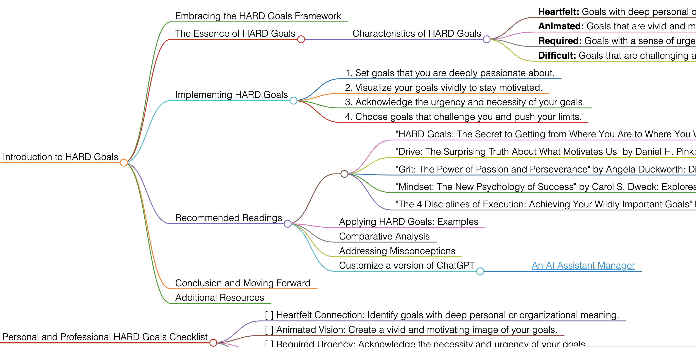

<h1>HARD Goals</h1>

# Introduction to HARD Goals

## Embracing the HARD Goals Framework
HARD Goals represent a goal-setting approach that focuses on objectives that are Heartfelt, Animated, Required, and Difficult. This framework is designed to encourage setting goals that truly resonate with personal or organizational ambition and drive significant achievements.

## The Essence of HARD Goals
HARD Goals challenge individuals and organizations to set objectives that are deeply engaging and exceptionally challenging, pushing the boundaries of what's considered achievable.

### Characteristics of HARD Goals
- **Heartfelt:** Goals with deep personal or organizational significance.
- **Animated:** Goals that are vivid and motivating, with a clear vision.
- **Required:** Goals with a sense of urgency and necessity.
- **Difficult:** Goals that are challenging and stretch abilities.

## Implementing HARD Goals
To apply HARD Goals effectively, follow these guidelines:
1. Set goals that you are deeply passionate about.
2. Visualize your goals vividly to stay motivated.
3. Acknowledge the urgency and necessity of your goals.
4. Choose goals that challenge you and push your limits.

## Recommended Readings
- "HARD Goals: The Secret to Getting from Where You Are to Where You Want to Be" by Mark Murphy: Provides a detailed guide to setting HARD Goals and the science behind them.
    - **Key Takeaways:** Techniques for setting goals that are emotionally engaging; strategies to make goals vivid and urgent.
- "Drive: The Surprising Truth About What Motivates Us" by Daniel H. Pink: Explores the factors that truly motivate people, including autonomy, mastery, and purpose, which align with the HARD Goals framework.
    - **Key Takeaways:** Insights into human motivation; application of these principles in goal setting.
- "Grit: The Power of Passion and Perseverance" by Angela Duckworth: Discusses the importance of grit - passion and perseverance - in achieving long-term goals, resonating with the 'Difficult' aspect of HARD Goals.
    - **Key Takeaways:** Understanding the role of perseverance in success; strategies to cultivate grit.
- "Mindset: The New Psychology of Success" by Carol S. Dweck: Explores the growth mindset, a key aspect in tackling the 'Difficult' part of HARD Goals.
    - **Key Takeaways:** Impact of mindset on achieving challenging goals; techniques for developing a growth mindset.
- "The 4 Disciplines of Execution: Achieving Your Wildly Important Goals" by Chris McChesney, Sean Covey, and Jim Huling: While not specifically about HARD Goals, this book offers a practical framework for executing ambitious goals.
    - **Key Takeaways:** Strategies for achieving significant objectives; importance of focus and accountability.

### Applying HARD Goals: Examples
Use HARD Goals for personal development, career advancement, organizational growth, or any scenario requiring significant transformation.

### Comparative Analysis
HARD Goals stand out for their emphasis on emotional connection, vivid visualization, urgency, and high challenge.

### Addressing Misconceptions
HARD Goals are not just about difficulty; they are about creating goals that are deeply meaningful and motivating.

### Customize a version of ChatGPT 
- [An AI Assistant Manager](https://pirahansiah.com/site/pages/ChatGPT)

## Conclusion and Moving Forward
By adopting the HARD Goals approach, you can set and achieve goals that are truly transformative. This guide has offered insights into effectively using HARD Goals in various aspects of life and work.

## Additional Resources
For further exploration of goal setting, motivation, and achieving challenging objectives, delve into the recommended literature.

# Personal and Professional HARD Goals Checklist
- [ ] Heartfelt Connection: Identify goals with deep personal or organizational meaning.
- [ ] Animated Vision: Create a vivid and motivating image of your goals.
- [ ] Required Urgency: Acknowledge the necessity and urgency of your goals.
- [ ] Difficult Challenge: Set goals that stretch your abilities and require perseverance.

<h1></h1>
