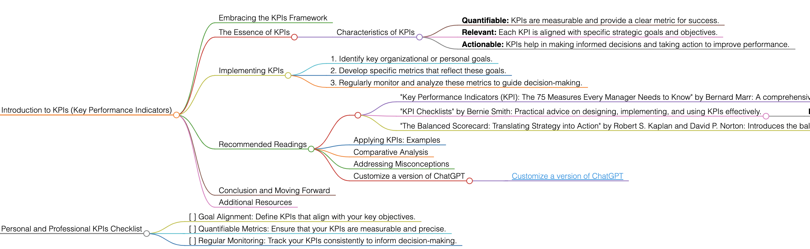

<h1>KPIs</h1>

# Introduction to KPIs (Key Performance Indicators)

## Embracing the KPIs Framework
KPIs (Key Performance Indicators) are crucial metrics used to evaluate the success of an organization, employee, or specific process in achieving key objectives. They provide a way to measure progress and are essential for data-driven decision-making.

## The Essence of KPIs
KPIs are quantifiable measures that reflect the critical success factors of an organization. They differ based on the organization's goals and are used to assess the effectiveness of operational processes.

### Characteristics of KPIs
- **Quantifiable:** KPIs are measurable and provide a clear metric for success.
- **Relevant:** Each KPI is aligned with specific strategic goals and objectives.
- **Actionable:** KPIs help in making informed decisions and taking action to improve performance.

## Implementing KPIs
To apply KPIs effectively, follow these guidelines:
1. Identify key organizational or personal goals.
2. Develop specific metrics that reflect these goals.
3. Regularly monitor and analyze these metrics to guide decision-making.

## Recommended Readings
- "Key Performance Indicators (KPI): The 75 Measures Every Manager Needs to Know" by Bernard Marr: A comprehensive guide on KPIs, offering insights into their selection and implementation.
    - **Key Takeaways:** Detailed exploration of various KPIs; strategies for selecting the right metrics.
- "KPI Checklists" by Bernie Smith: Practical advice on designing, implementing, and using KPIs effectively.
    - **Key Takeaways:** Step-by-step guidance on KPI development; tips for ensuring KPIs are actionable and aligned with goals.
- "The Balanced Scorecard: Translating Strategy into Action" by Robert S. Kaplan and David P. Norton: Introduces the balanced scorecard, a strategic management system that includes financial and non-financial KPIs.
    - **Key Takeaways:** Framework for aligning business activities to the vision and strategy; comprehensive approach to performance measurement.

### Applying KPIs: Examples
Use KPIs in various scenarios, from measuring business performance, employee productivity, to tracking project progress.

### Comparative Analysis
KPIs stand out for their focus on quantifiable metrics, data analysis, and their role in strategic decision-making.

### Addressing Misconceptions
KPIs are not just for business analytics; they can be effectively applied in personal development, education, and other areas.

### Customize a version of ChatGPT 
- [Customize a version of ChatGPT](https://chat.openai.com/g/g-3JEKe3tVr-goal-setting-guru)

## Conclusion and Moving Forward
By adopting KPIs, you can measure and track performance effectively, helping to ensure that strategic objectives are met. This guide has offered insights into using KPIs in various contexts for data-driven decision-making.

## Additional Resources
For further exploration of performance measurement and management, delve into the recommended literature.

# Personal and Professional KPIs Checklist
- [ ] Goal Alignment: Define KPIs that align with your key objectives.
- [ ] Quantifiable Metrics: Ensure that your KPIs are measurable and precise.
- [ ] Regular Monitoring: Track your KPIs consistently to inform decision-making.

<h1></h1>
