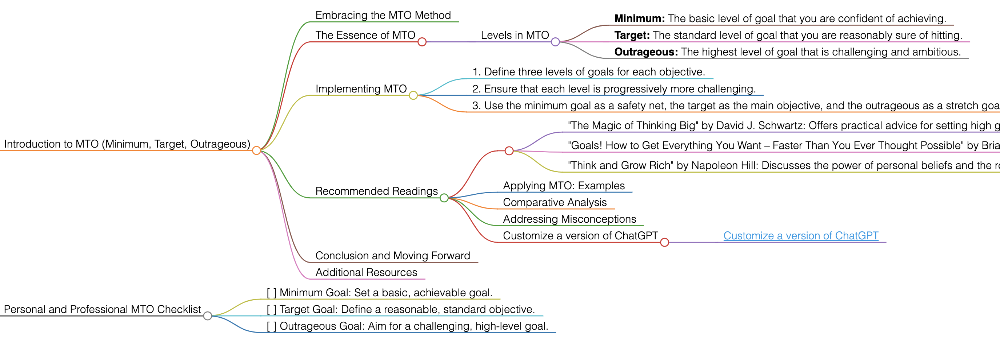

<h1>MTO (Minimum, Target, Outrageous)</h1>

# Introduction to MTO (Minimum, Target, Outrageous)

## Embracing the MTO Method
MTO (Minimum, Target, Outrageous) is a goal-setting method that encourages setting three levels of goals: a minimum level that ensures basic success, a target level that represents expected success, and an outrageous level that aims for extraordinary success.

## The Essence of MTO
This method allows for flexibility and adaptability in goal setting. It helps in managing expectations while encouraging one to aim higher and push boundaries.

### Levels in MTO
- **Minimum:** The basic level of goal that you are confident of achieving.
- **Target:** The standard level of goal that you are reasonably sure of hitting.
- **Outrageous:** The highest level of goal that is challenging and ambitious.

## Implementing MTO
To apply MTO effectively, follow these guidelines:
1. Define three levels of goals for each objective.
2. Ensure that each level is progressively more challenging.
3. Use the minimum goal as a safety net, the target as the main objective, and the outrageous as a stretch goal.

## Recommended Readings
- "The Magic of Thinking Big" by David J. Schwartz: Offers practical advice for setting high goals and thinking in a way that facilitates achievement.
    - **Key Takeaways:** Importance of setting high expectations; strategies to overcome mental barriers.
- "Goals! How to Get Everything You Want – Faster Than You Ever Thought Possible" by Brian Tracy: A guide to setting and achieving goals in personal and professional life.
    - **Key Takeaways:** Methods for effective goal setting; techniques to increase productivity and achieve goals.
- "Think and Grow Rich" by Napoleon Hill: Discusses the power of personal beliefs and the role they play in personal success.
    - **Key Takeaways:** Understanding the psychology of success; principles for achieving personal and professional goals.

### Applying MTO: Examples
Use MTO in various scenarios, such as personal development, career goals, or business objectives.

### Comparative Analysis
MTO stands out for its tiered approach, offering a balanced method between achievable and aspirational goals.

### Addressing Misconceptions
MTO is not just about setting achievable goals; it also encourages reaching for aspirational heights.

### Customize a version of ChatGPT 
- [Customize a version of ChatGPT](https://chat.openai.com/g/g-3JEKe3tVr-goal-setting-guru)

## Conclusion and Moving Forward
By adopting the MTO method, you can set goals that are balanced between realistic and ambitious. This guide has offered insights into effectively using MTO in various aspects of life and work.

## Additional Resources
For further exploration of goal setting and achieving different levels of objectives, delve into the recommended literature.

# Personal and Professional MTO Checklist
- [ ] Minimum Goal: Set a basic, achievable goal.
- [ ] Target Goal: Define a reasonable, standard objective.
- [ ] Outrageous Goal: Aim for a challenging, high-level goal.

<h1></h1>
