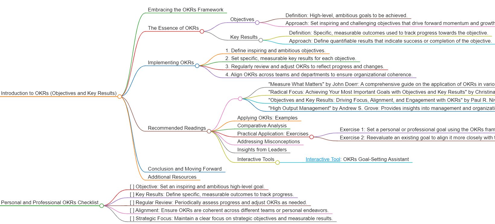

<h1>OKRs</h1>

# Introduction to OKRs (Objectives and Key Results)

## Embracing the OKRs Framework
OKRs (Objectives and Key Results) offer a strategic approach to goal setting, emphasizing the importance of setting ambitious objectives and tracking measurable results. This framework is particularly effective in environments where clarity, focus, and measurable outcomes are key.

## The Essence of OKRs
OKRs focus on setting high-level objectives and tracking progress through specific, quantifiable key results. This methodology aligns teams and individuals around shared goals and provides a clear path to achieving them.

### Objectives
- Definition: High-level, ambitious goals to be achieved.
- Approach: Set inspiring and challenging objectives that drive forward momentum and growth.

### Key Results
- Definition: Specific, measurable outcomes used to track progress towards the objective.
- Approach: Define quantifiable results that indicate success or completion of the objective.

## Implementing OKRs
To apply OKRs effectively, follow these guidelines:
1. Define inspiring and ambitious objectives.
2. Set specific, measurable key results for each objective.
3. Regularly review and adjust OKRs to reflect progress and changes.
4. Align OKRs across teams and departments to ensure organizational coherence.

## Recommended Readings
- "Measure What Matters" by John Doerr: A comprehensive guide on the application of OKRs in various organizational settings.
- "Radical Focus: Achieving Your Most Important Goals with Objectives and Key Results" by Christina Wodtke: Offers practical advice on using OKRs to focus effort and drive results.
- "Objectives and Key Results: Driving Focus, Alignment, and Engagement with OKRs" by Paul R. Niven and Ben Lamorte: Explores the nuances of implementing OKRs in diverse environments.
- "High Output Management" by Andrew S. Grove: Provides insights into management and organizational effectiveness, including the use of OKRs.

### Applying OKRs: Examples
Use OKRs in various scenarios, such as setting organizational targets, personal development goals, or team-based projects.

### Comparative Analysis
OKRs stand out for their emphasis on ambitious objectives and measurable results, making them ideal for environments that value strategic clarity and accountability.

### Practical Application: Exercises
- Exercise 1: Set a personal or professional goal using the OKRs framework.
- Exercise 2: Reevaluate an existing goal to align it more closely with the OKRs principles.

### Addressing Misconceptions
OKRs are not just for corporate settings; they can be effectively applied in any context where goal clarity and measurable outcomes are desired.

### Insights from Leaders
Quotes from industry leaders can underscore the importance of strategic focus and measurable achievements in goal setting.

### Interactive Tools
Utilize online resources and tools designed to help structure and track OKRs effectively.
- [Interactive Tool](#): OKRs Goal-Setting Assistant

## Conclusion and Moving Forward
By integrating the OKRs approach, you can set goals that are strategic, focused, and measurable. This guide has offered insights into effectively using the OKRs methodology in various aspects of life and work.

## Additional Resources
For a deeper understanding of strategic planning and goal setting, explore related literature and case studies.

# Personal and Professional OKRs Checklist
- [ ] Objective: Set an inspiring and ambitious high-level goal.
- [ ] Key Results: Define specific, measurable outcomes to track progress.
- [ ] Regular Review: Periodically assess progress and adjust OKRs as needed.
- [ ] Alignment: Ensure OKRs are coherent across different teams or personal endeavors.
- [ ] Strategic Focus: Maintain a clear focus on strategic objectives and measurable results.

<h1></h1>
