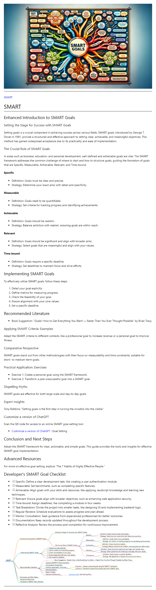

<h1></h1>

# SMART
## Enhanced Introduction to SMART Goals
### Setting the Stage for Success with SMART Goals
Setting goals is a crucial component in achieving success across various fields. SMART goals, introduced by George T. Doran in 1981, provide a structured and effective approach to setting clear, achievable, and meaningful objectives. This method has gained widespread acceptance due to its practicality and ease of implementation.
### The Crucial Role of SMART Goals
In areas such as business, education, and personal development, well-defined and achievable goals are vital. The SMART framework addresses the common challenge of where to start and how to structure goals, guiding the formation of goals that are Specific, Measurable, Achievable, Relevant, and Time-bound.
#### Specific
- Definition: Goals must be clear and precise.
- Strategy: Determine your exact aims with detail and specificity.
#### Measurable
- Definition: Goals need to be quantifiable.
- Strategy: Set criteria for tracking progress and identifying achievements.
#### Achievable
- Definition: Goals should be realistic.
- Strategy: Balance ambition with realism, ensuring goals are within reach.
#### Relevant
- Definition: Goals should be significant and align with broader aims.
- Strategy: Select goals that are meaningful and align with your values.
#### Time-bound
- Definition: Goals require a specific deadline.
- Strategy: Set deadlines to maintain focus and drive efforts.

## Implementing SMART Goals
To effectively utilize SMART goals, follow these steps:
1. Detail your goal explicitly.
2. Define metrics for measuring progress.
3. Check the feasibility of your goal.
4. Ensure alignment with your core values.
5. Set a specific deadline.

## Recommended Literature
- Book Suggestion: "Goals!: How to Get Everything You Want — Faster Than You Ever Thought Possible" by Brian Tracy.
### Applying SMART Criteria: Examples
Adapt the SMART criteria to different contexts, like a professional goal to increase revenue or a personal goal to improve fitness.
### Comparative Perspective
SMART goals stand out from other methodologies with their focus on measurability and time constraints, suitable for short- to medium-term goals.
### Practical Application: Exercises
- Exercise 1: Create a personal goal using the SMART framework.
- Exercise 2: Transform a past unsuccessful goal into a SMART goal.
### Dispelling Myths
SMART goals are effective for both large-scale and day-to-day goals.
### Expert Insights
Tony Robbins: "Setting goals is the first step in turning the invisible into the visible."
### Customize a version of ChatGPT 
Scan the QR code for access to an online SMART goal-setting tool.
- [Customize a version of ChatGPT ](https://chat.openai.com/g/g-3JEKe3tVr-goal-setting-guru): Goal Setting 

## Conclusion and Next Steps
Adopt the SMART framework for clear, actionable, and simple goals. This guide provides the tools and insights for effective SMART goal implementation.
## Advanced Resources
For more on effective goal setting, explore "The 7 Habits of Highly Effective People."
## Developer's SMART Goal Checklist
- [ ] Specific: Define a clear development task, like creating a user authentication module.
- [ ] Measurable: Set benchmarks, such as completing specific features.
- [ ] Achievable: Align goals with your skills and resources, like applying JavaScript knowledge and learning new techniques.
- [ ] Relevant: Ensure goals align with broader objectives, such as enhancing web application security.
- [ ] Time-bound: Assign deadlines, like completing a module in four weeks.
- [ ] Task Breakdown: Divide the project into smaller tasks, like designing UI and implementing backend logic.
- [ ] Regular Reviews: Schedule evaluations to assess progress and plan ahead.
- [ ] Mentor Consultation: Seek guidance from experienced professionals for better outcomes.
- [ ] Documentation: Keep records updated throughout the development process.
- [ ] Reflective Analysis: Review the process post-completion for continuous improvement.

<h1></h1>