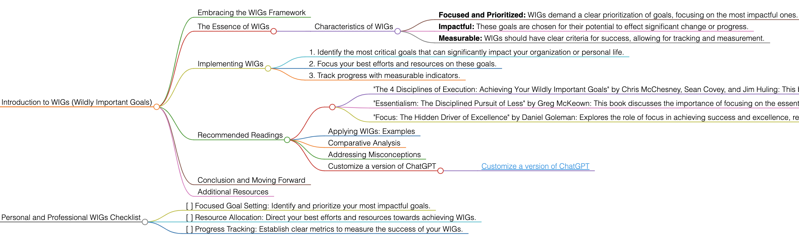

<h1>WIGs</h1>

# Introduction to WIGs (Wildly Important Goals)

## Embracing the WIGs Framework
WIGs (Wildly Important Goals) is a concept that emphasizes focusing on the most crucial objectives in any endeavor. It is about identifying and committing to goals that can make the most significant impact.

## The Essence of WIGs
WIGs are about narrowing focus to what is essential. The idea is to concentrate efforts on one or two goals that will make the biggest difference, rather than spreading resources too thinly across many objectives.

### Characteristics of WIGs
- **Focused and Prioritized:** WIGs demand a clear prioritization of goals, focusing on the most impactful ones.
- **Impactful:** These goals are chosen for their potential to effect significant change or progress.
- **Measurable:** WIGs should have clear criteria for success, allowing for tracking and measurement.

## Implementing WIGs
To apply WIGs effectively, follow these guidelines:
1. Identify the most critical goals that can significantly impact your organization or personal life.
2. Focus your best efforts and resources on these goals.
3. Track progress with measurable indicators.

## Recommended Readings
- "The 4 Disciplines of Execution: Achieving Your Wildly Important Goals" by Chris McChesney, Sean Covey, and Jim Huling: This book provides a practical framework for achieving WIGs, focusing on execution strategies.
    - **Key Takeaways:** A clear methodology for focusing on and achieving WIGs; practical examples and case studies.
- "Essentialism: The Disciplined Pursuit of Less" by Greg McKeown: This book discusses the importance of focusing on the essential, which aligns with the WIGs philosophy.
    - **Key Takeaways:** Strategies for identifying what is truly essential; the importance of prioritization and elimination in achieving goals.
- "Focus: The Hidden Driver of Excellence" by Daniel Goleman: Explores the role of focus in achieving success and excellence, relevant to the pursuit of WIGs.
    - **Key Takeaways:** Insights into the science of attention; the role of focus in personal and professional success.

### Applying WIGs: Examples
Use WIGs in various scenarios, such as setting key business objectives, personal development goals, or educational achievements.

### Comparative Analysis
WIGs stand out for their focus on prioritizing and intensely pursuing a limited number of significant goals.

### Addressing Misconceptions
WIGs are applicable in various settings, from personal development to organizational strategy.

### Customize a version of ChatGPT 
- [Customize a version of ChatGPT](https://chat.openai.com/g/g-3JEKe3tVr-goal-setting-guru)

## Conclusion and Moving Forward
By adopting the WIGs approach, you can focus on achieving the goals that matter most. This guide has offered insights into effectively using the WIGs methodology in different aspects of life and work.

## Additional Resources
For further exploration of focused goal setting and achieving significant objectives, delve into the recommended literature.

# Personal and Professional WIGs Checklist
- [ ] Focused Goal Setting: Identify and prioritize your most impactful goals.
- [ ] Resource Allocation: Direct your best efforts and resources towards achieving WIGs.
- [ ] Progress Tracking: Establish clear metrics to measure the success of your WIGs.

<h1></h1>
