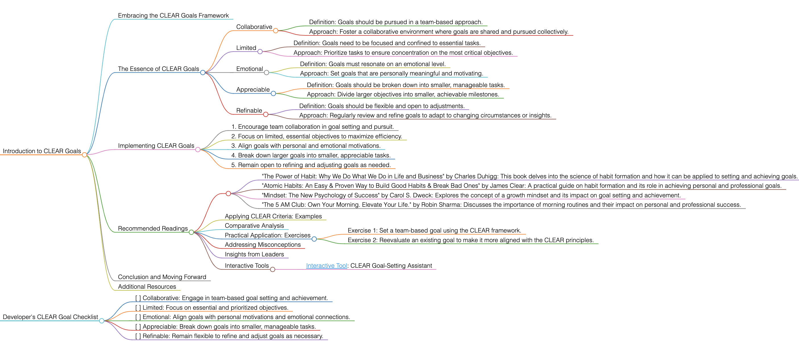

<h1>CLEAR</h1>

# Introduction to CLEAR Goals

## Embracing the CLEAR Goals Framework
CLEAR goals offer a structured yet flexible approach to goal setting, emphasizing the importance of collaboration and adaptability. This framework is particularly effective in environments where teamwork and continuous refinement are key.

## The Essence of CLEAR Goals
CLEAR, an acronym for Collaborative, Limited, Emotional, Appreciable, and Refinable, is a goal-setting approach that focuses on manageable and emotionally engaging objectives. It is designed for settings where adaptability and shared efforts are valued.

### Collaborative
- Definition: Goals should be pursued in a team-based approach.
- Approach: Foster a collaborative environment where goals are shared and pursued collectively.

### Limited
- Definition: Goals need to be focused and confined to essential tasks.
- Approach: Prioritize tasks to ensure concentration on the most critical objectives.

### Emotional
- Definition: Goals must resonate on an emotional level.
- Approach: Set goals that are personally meaningful and motivating.

### Appreciable
- Definition: Goals should be broken down into smaller, manageable tasks.
- Approach: Divide larger objectives into smaller, achievable milestones.

### Refinable
- Definition: Goals should be flexible and open to adjustments.
- Approach: Regularly review and refine goals to adapt to changing circumstances or insights.

## Implementing CLEAR Goals
To apply CLEAR goals effectively, follow these guidelines:
1. Encourage team collaboration in goal setting and pursuit.
2. Focus on limited, essential objectives to maximize efficiency.
3. Align goals with personal and emotional motivations.
4. Break down larger goals into smaller, appreciable tasks.
5. Remain open to refining and adjusting goals as needed.

## Recommended Readings
- "The Power of Habit: Why We Do What We Do in Life and Business" by Charles Duhigg: This book delves into the science of habit formation and how it can be applied to setting and achieving goals.
- "Atomic Habits: An Easy & Proven Way to Build Good Habits & Break Bad Ones" by James Clear: A practical guide on habit formation and its role in achieving personal and professional goals.
- "Mindset: The New Psychology of Success" by Carol S. Dweck: Explores the concept of a growth mindset and its impact on goal setting and achievement.
- "The 5 AM Club: Own Your Morning. Elevate Your Life." by Robin Sharma: Discusses the importance of morning routines and their impact on personal and professional success.

### Applying CLEAR Criteria: Examples
Use CLEAR criteria in various scenarios, such as working on a team project or setting personal development goals.

### Comparative Analysis
CLEAR goals stand apart for their emphasis on emotional engagement and flexibility, making them ideal for environments that value adaptability and personal growth.

### Practical Application: Exercises
- Exercise 1: Set a team-based goal using the CLEAR framework.
- Exercise 2: Reevaluate an existing goal to make it more aligned with the CLEAR principles.

### Addressing Misconceptions
CLEAR goals are suitable for both individual and team settings, and can be effectively applied in various aspects of life.

### Insights from Leaders
Quotes from industry leaders can highlight the importance of emotional engagement and adaptability in goal setting.

### Customize a version of ChatGPT
Utilize online resources and tools designed to help structure and track CLEAR goals effectively.
- [Customize a version of ChatGPT ](https://chat.openai.com/g/g-3JEKe3tVr-goal-setting-guru): Goal Setting : FAST Goal-Setting Assistant

## Conclusion and Moving Forward
By integrating the CLEAR approach, you can set goals that are collaborative, emotionally engaging, and adaptable to changes. This guide has offered insights into effectively using the CLEAR methodology in various aspects of life and work.

## Additional Resources
For a deeper understanding of emotional intelligence and collaborative goal setting, explore related literature and case studies.

# Developer's CLEAR Goal Checklist
- [ ] Collaborative: Engage in team-based goal setting and achievement.
- [ ] Limited: Focus on essential and prioritized objectives.
- [ ] Emotional: Align goals with personal motivations and emotional connections.
- [ ] Appreciable: Break down goals into smaller, manageable tasks.
- [ ] Refinable: Remain flexible to refine and adjust goals as necessary.

<h1></h1>
