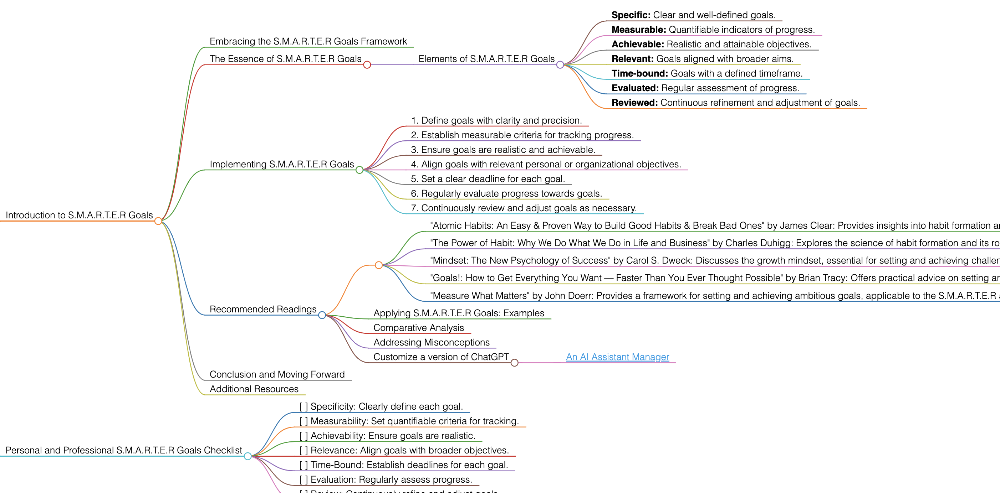

<h1>S.M.A.R.T.E.R Goals</h1>

# Introduction to S.M.A.R.T.E.R Goals

## Embracing the S.M.A.R.T.E.R Goals Framework
S.M.A.R.T.E.R Goals build upon the traditional SMART goals framework by adding two crucial components: Evaluated and Reviewed. This approach emphasizes the importance of ongoing assessment and adaptation in goal setting and achievement.

## The Essence of S.M.A.R.T.E.R Goals
S.M.A.R.T.E.R Goals are about setting objectives that are not only specific, measurable, achievable, relevant, and time-bound but also consistently evaluated and reviewed for effectiveness and relevance.

### Elements of S.M.A.R.T.E.R Goals
- **Specific:** Clear and well-defined goals.
- **Measurable:** Quantifiable indicators of progress.
- **Achievable:** Realistic and attainable objectives.
- **Relevant:** Goals aligned with broader aims.
- **Time-bound:** Goals with a defined timeframe.
- **Evaluated:** Regular assessment of progress.
- **Reviewed:** Continuous refinement and adjustment of goals.

## Implementing S.M.A.R.T.E.R Goals
To apply S.M.A.R.T.E.R Goals effectively, follow these guidelines:
1. Define goals with clarity and precision.
2. Establish measurable criteria for tracking progress.
3. Ensure goals are realistic and achievable.
4. Align goals with relevant personal or organizational objectives.
5. Set a clear deadline for each goal.
6. Regularly evaluate progress towards goals.
7. Continuously review and adjust goals as necessary.

## Recommended Readings
- "Atomic Habits: An Easy & Proven Way to Build Good Habits & Break Bad Ones" by James Clear: Provides insights into habit formation and goal achievement, relevant to the S.M.A.R.T.E.R framework.
    - **Key Takeaways:** Importance of small changes; strategies for habit formation; aligning habits with goals.
- "The Power of Habit: Why We Do What We Do in Life and Business" by Charles Duhigg: Explores the science of habit formation and its role in achieving goals.
    - **Key Takeaways:** Mechanisms behind habits; impact on goal achievement; case studies.
- "Mindset: The New Psychology of Success" by Carol S. Dweck: Discusses the growth mindset, essential for setting and achieving challenging goals.
    - **Key Takeaways:** Growth vs. fixed mindset; impact on personal development; strategies for fostering a growth mindset.
- "Goals!: How to Get Everything You Want — Faster Than You Ever Thought Possible" by Brian Tracy: Offers practical advice on setting and achieving goals, aligning with the S.M.A.R.T.E.R framework.
    - **Key Takeaways:** Goal setting strategies; importance of clarity and focus; techniques for efficient goal achievement.
- "Measure What Matters" by John Doerr: Provides a framework for setting and achieving ambitious goals, applicable to the S.M.A.R.T.E.R approach.
    - **Key Takeaways:** Objectives and Key Results (OKRs) framework; case studies; importance of measurable goals.

### Applying S.M.A.R.T.E.R Goals: Examples
Use S.M.A.R.T.E.R Goals for personal development, career planning, business strategy, or any area requiring structured and adaptive goal setting.

### Comparative Analysis
S.M.A.R.T.E.R Goals stand out for their emphasis on ongoing evaluation and review, enhancing the traditional SMART framework.

### Addressing Misconceptions
S.M.A.R.T.E.R Goals are not just about setting goals; they're about creating a dynamic process of continuous improvement.

### Customize a version of ChatGPT 
- [An AI Assistant Manager](https://pirahansiah.com/site/pages/ChatGPT)

## Conclusion and Moving Forward
By adopting the S.M.A.R.T.E.R Goals approach, you can set goals that are not only clear and achievable but also adaptable and continuously improving. This guide has offered insights into effectively using S.M.A.R.T.E.R Goals in various aspects of life and work.

## Additional Resources
For further exploration of goal setting, habit formation, and effective achievement strategies, delve into the recommended literature.

# Personal and Professional S.M.A.R.T.E.R Goals Checklist
- [ ] Specificity: Clearly define each goal.
- [ ] Measurability: Set quantifiable criteria for tracking.
- [ ] Achievability: Ensure goals are realistic.
- [ ] Relevance: Align goals with broader objectives.
- [ ] Time-Bound: Establish deadlines for each goal.
- [ ] Evaluation: Regularly assess progress.
- [ ] Review: Continuously refine and adjust goals.

<h1></h1>
